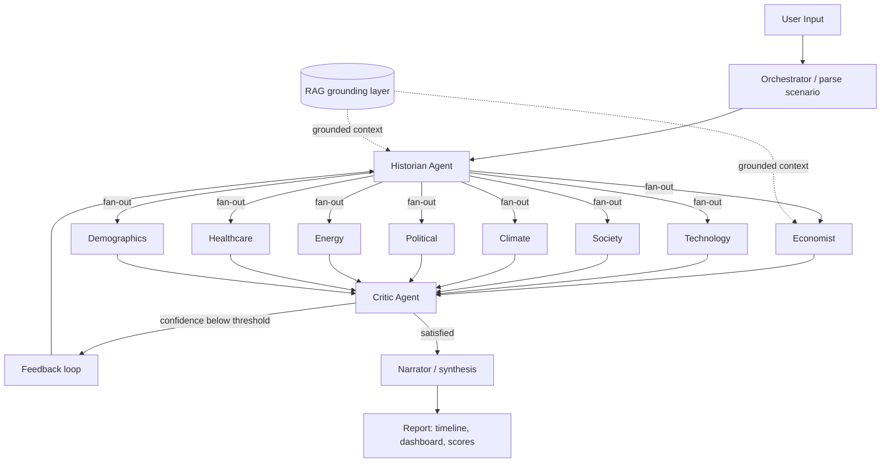

# Anamnesis-AI

### Reimagine the Past. Simulate the Future.

Anamnesis-AI is a **multi-agent simulation and decision intelligence web application** that explores alternate histories and future policy scenarios through collaborative AI reasoning.

It lets users test "what-if" scenarios across economy, technology, society, politics, climate, energy, healthcare and demographics — and understand the long-term, cross-domain consequences of a decision *before* it is made.

> Built with **LangGraph multi-agent orchestration**, a **retrieval-augmented (RAG) grounding layer**, a **critic/verification loop**, and deployed as a full-stack app (Next.js frontend + FastAPI backend). Everything runs on **free data sources and the Gemini free tier** — no paid services required.

Repository: **[github.com/Anamnesis-AI-Org/Anamnesis-AI](https://github.com/Anamnesis-AI-Org/Anamnesis-AI)**

```bash
git clone https://github.com/Anamnesis-AI-Org/Anamnesis-AI.git
```

---

## Core idea

Modern decisions are made in silos: economists look at cost, environmentalists at sustainability, policy experts at governance, social scientists at behaviour — but these perspectives are rarely combined into one simulation.

**Anamnesis-AI solves this by simulating a decision with multiple specialized AI agents that collaborate like an expert council**, grounding every analysis in real-world data, then merging their outputs into a single, scored, citation-backed report.

---

## Features

- 🔄 **Alternate-history simulation engine** — seed a divergence point and branch reality forward.
- 🔮 **Future scenario forecasting** — model policy and technology outcomes over a time horizon.
- 🧠 **9 domain agents + Critic** running in a LangGraph fan-out / fan-in graph with a feedback loop.
- 📚 **RAG grounding layer** — Wikipedia, arXiv, World Bank, UN Data, NASA and NOAA, vectorised in ChromaDB.
- ⚖️ **Verification & explainability** — grounding/source validation, confidence, uncertainty and calibration scores.
- 🕸️ **Causal graph + assumption registry** — LLM-derived cause/effect links and extracted assumptions.
- 💬 **Exploration Lab** — ask follow-up questions, stage agent-vs-agent debates, and re-simulate with adjusted parameters.
- 🌿 **Timeline branching** — fork a new scenario from any event while locking in pre-divergence history.
- 🔌 **Live telemetry** — WebSocket stream of agent progress while a simulation runs.
- 📊 **Interactive report** — gauges, radar footprint, world/impact map, interactive timeline, decision tree and causal DAG.

---

## Architecture



The pipeline is a LangGraph `StateGraph` defined in `backend/app/orchestrator.py`:

1. **parse_scenario** — turns the raw "what-if" text into a structured `ScenarioContext` (divergence year, focus domains, time horizon).
2. **historian** — reconstructs baseline reality and the divergence point.
3. **domain agents** (parallel) — economist, technology, society, climate, political, energy, healthcare, demographics each emit analysis text, timeline events and a `-100..100` impact score, grounded with retrieved context.
4. **critic** — audits cross-agent consistency and produces a confidence score, per-agent confidences and risk notes.
5. **feedback loop** — if confidence is below the threshold (max 2 iterations), the critic's feedback is routed back to the historian to re-run.
6. **narrator** — merges everything into a unified timeline, impact dashboard and final report.

Post-processing adds a **causal graph**, **assumptions**, **grounding validations**, an **uncertainty score** and a **calibration score**.

---

## Tech stack

| Layer | Technology |
|---|---|
| Frontend | Next.js 14 (App Router) · React 18 · TypeScript · Tailwind CSS · Framer Motion · GSAP |
| Backend | FastAPI · Uvicorn · async SQLAlchemy |
| Agent orchestration | LangGraph |
| LLM | Google Gemini (`google-genai`) — free tier |
| Vector store | ChromaDB (in-memory fallback if unavailable) |
| Database | SQLite (dev) / PostgreSQL (prod) |
| Data sources | Wikipedia, arXiv, World Bank, UN Data, NASA, NOAA — all free |
| Deploy | Vercel (frontend) · Render (backend) · Supabase (Postgres) · Docker |

> ⛔ No paid services: no Foundry IQ, no OpenAI/Anthropic, no paid datasets.

---

## Repository structure

```
Anamnesis-AI/
├── backend/                 # FastAPI + LangGraph backend
│   ├── app/
│   │   ├── main.py          # HTTP + WebSocket API entrypoint
│   │   ├── orchestrator.py  # LangGraph multi-agent graph
│   │   ├── agents/          # historian, economist, technology, society, climate,
│   │   │                    # political, energy, healthcare, demographics, critic
│   │   ├── rag/             # loaders, chunker, reranker, cache, embedding, sources/
│   │   ├── simulation/      # causal_graph, assumption_tracker, branching_engine
│   │   ├── validation/      # source_validator, uncertainty, calibration
│   │   ├── exploration/     # qa_engine, debate_engine, parameter_adjuster
│   │   ├── llm_client.py    # Gemini client with failover + JSON retry
│   │   ├── prompts.py       # all agent system prompts
│   │   └── timeline_engine.py
│   └── tests/               # pytest suite (offline, mocked LLM)
├── frontend/                # Next.js app
│   ├── app/                 # pages: home, simulation, report, library, compare, ...
│   ├── components/          # gauges, timeline, causal graph, decision tree, maps
│   └── lib/                 # api client, types, mock scenarios
├── docker-compose.yml
├── render.yaml              # Render backend blueprint
└── README.md
```

---

## Local development

### Prerequisites
- Python 3.11+
- Node.js 20+
- A Google **Gemini API key** (free tier)

### 1. Backend

```bash
cd backend
python -m venv .venv
.venv/Scripts/activate
pip install -r requirements.txt
```

Create `backend/.env`:

```env
# SQLite (default) — no database setup required
DATABASE_URL=sqlite+aiosqlite:///./anamnesis.db

GEMINI_API_KEY=your_gemini_key
GEMINI_MODEL=gemini-flash-lite-latest
GEMINI_FALLBACK_MODELS=gemini-3.5-flash-lite,gemini-flash-latest

CORS_ORIGINS=http://localhost:3000
```

Run:

```bash
uvicorn app.main:app --reload --host 127.0.0.1 --port 8000
curl http://127.0.0.1:8000/
```

### 2. Frontend

```bash
cd frontend
npm install
npm run dev
```

Set `frontend/.env.local`:

```env
NEXT_PUBLIC_API_BASE_URL=http://localhost:8000
```

Open http://localhost:3000.

### 3. Tests

```bash
cd backend
python -m pytest tests/ -v
```

Tests run **offline** — the Gemini network layer is replaced by canned JSON via a fixture in `tests/conftest.py`.

### 4. Docker (optional)

```bash
docker compose up --build
```

---

## API reference

| Method | Endpoint | Description |
|---|---|---|
| `GET` | `/` | Health check (service + database status) |
| `POST` | `/api/scenarios` | Create a scenario and start a simulation (background) |
| `GET` | `/api/scenarios/{id}/status` | Poll status + completed agents |
| `GET` | `/api/scenarios/{id}/report` | Fetch the final report (409 while running) |
| `POST` | `/api/scenarios/{id}/branch` | Fork a scenario from a timeline event |
| `POST` | `/api/scenarios/{id}/ask` | Ask a grounded question about the report |
| `POST` | `/api/scenarios/{id}/debate` | Structured two-round debate between two agents |
| `POST` | `/api/scenarios/{id}/adjust` | Re-simulate with adjusted parameters |
| `WS` | `/api/scenarios/{id}/ws` | Live agent progress telemetry |

Example — start a simulation:

```bash
curl -X POST http://127.0.0.1:8000/api/scenarios \
  -H "Content-Type: application/json" \
  -d '{"raw_input": "What if the Library of Alexandria was never destroyed?"}'
```

---

## Deployment (free tiers)

### Frontend → Vercel
1. Import the repo in Vercel and set **Root Directory = `frontend`** (framework auto-detected as Next.js).
2. Set `NEXT_PUBLIC_API_BASE_URL = https://<your-render-service>.onrender.com`
3. Deploy.

The status page uses **polling** as the primary mechanism; the WebSocket stream is an enhancement that degrades gracefully if unavailable.

### Backend → Render
Use the included `render.yaml` blueprint, or create a **Web Service** manually. Either way the Docker settings matter:

| Setting | Value |
|---|---|
| Runtime | Docker |
| Dockerfile path (from **repo root**) | `./backend/Dockerfile` |
| Docker context | `./backend` |
| Health check path | `/` |

> `dockerfilePath` is resolved from the **repo root** while `dockerContext` is the directory handed to `docker build`, so both must point into `backend/`. The image binds to `$PORT` (Render sets `10000`), so no port edits are needed.

```env
APP_ENV=production
LOG_FORMAT=json
CORS_ORIGINS=https://<your-app>.vercel.app
GEMINI_API_KEY=your_gemini_key
DATABASE_URL=<Supabase connection string (see below)>
```

- Free web services spin down on inactivity (cold start on first request), and a full simulation takes ~2–4 minutes.
- WebSockets are supported, so the live telemetry stream works in production.

### Database → Supabase (free tier)
1. Create a Supabase project and copy the **connection string** from *Settings → Database* (Session pooler).
2. Set it as `DATABASE_URL`, ensuring the scheme is `postgresql+asyncpg://` and `sslmode=require`:

```env
DATABASE_URL=postgresql+asyncpg://postgres.<ref>:<password>@aws-0-<region>.pooler.supabase.com:6543/postgres?sslmode=require
```

Tables are created automatically on startup. Leave `DATABASE_URL` unset to fall back to SQLite.

> Without Supabase the backend runs on SQLite; on the Render free tier the filesystem is ephemeral, so reports persist only for the instance lifetime.

---

## Data sources (all free)

- 🌍 **World Bank** — GDP, population, electricity access, CO₂ indicators
- 🏛 **UN Data** — SDG / development indicators
- 🌌 **NASA** — Earth science / planetary data
- 🌦 **NOAA** — climate & precipitation datasets
- 📖 **Wikipedia** — historical context and events
- 📚 **arXiv** — research paper abstracts

Retrieved documents are chunked, embedded and re-ranked before being passed to agents.

---

## Disclaimer

Anamnesis-AI provides simulated, AI-generated outcomes based on available data and probabilistic reasoning. It is intended for **educational and exploratory purposes only** and should not be treated as factual prediction or guaranteed forecasting.

